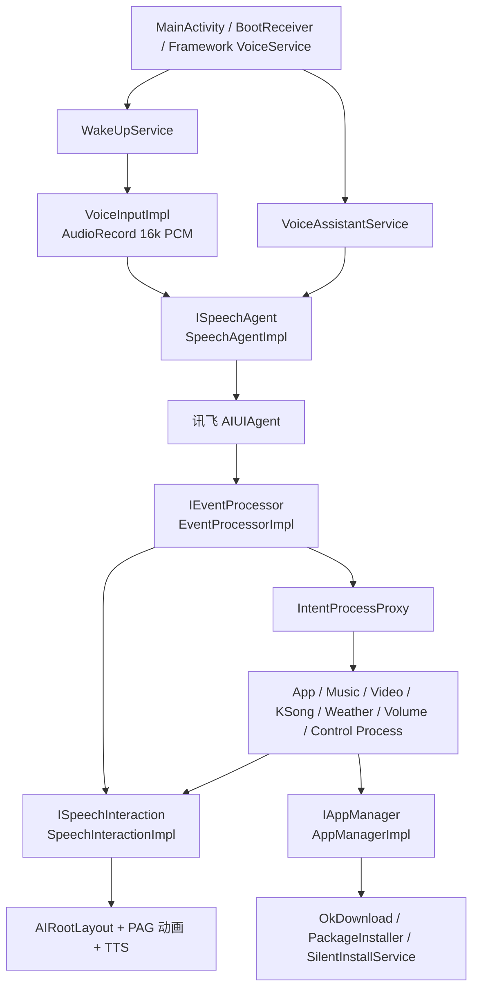
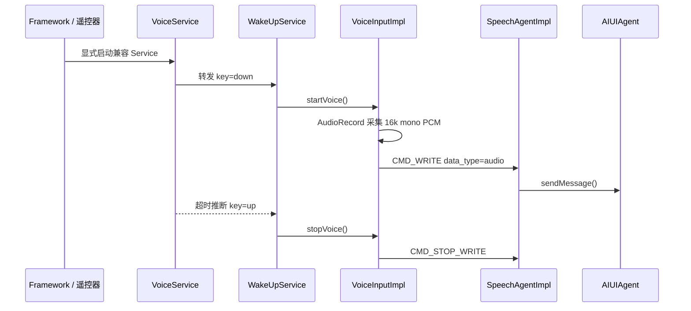
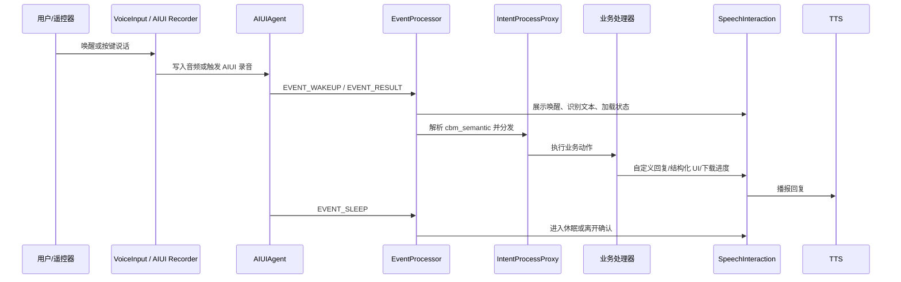

# AI Assistant Android 语音项目系统架构介绍

## 1. 项目定位

本工程是一个面向 Android 设备的语音助手应用，核心能力包括语音唤醒/按键录音、讯飞 AIUI 语音识别与语义理解、大模型/NLP 回复展示、语音合成、应用下载安装与静默升级，以及对音乐、视频、K 歌、天气、音量等场景的语义指令处理。

工程默认按系统签名应用运行。`system` buildType 会合并 `app/src/system/AndroidManifest.xml`，使应用具备 `android.uid.system`、应用常驻、开机自启动、悬浮窗交互和系统级安装等系统集成能力。工程中保留非系统签名构建，主要用于在非 root 手机上进行调试验证。

## 2. 模块划分

项目采用 Gradle 多模块结构，根工程包含 `app`、`speech`、`processor`、`downloader`、`common` 五个核心模块。

| 模块 | 职责 |
| --- | --- |
| `app` | 应用入口、系统签名运行适配、前台/常驻服务、遥控器语音按键兼容、AudioRecord 录音输入、WorkManager 升级任务、Hilt 应用级装配。 |
| `speech` | 封装讯飞 AIUI SDK，负责设备鉴权、AIUI 配置加载、AIUIAgent 生命周期、网络恢复后重连/鉴权、AIUI 事件回调入口。 |
| `processor` | 负责 AIUI 事件解析、IAT/NLP/语义结果聚合、TTS 控制，以及将语义意图分发到应用、音量、天气、音乐、视频、K 歌等业务处理器。 |
| `downloader` | 负责 APK 下载队列、安装状态管理、系统静默安装、安装结果广播与事件分发。 |
| `common` | 公共模型、枚举、网络层、缓存、图片加载、语音交互 UI、存储、工具类和基础组件。 |

外部资源主要包括：

| 目录 | 内容 |
| --- | --- |
| `iflytek/libs` | 讯飞 AIUI 本地 Jar。 |
| `iflytek/jniLibs` | AIUI 和唤醒相关 so 库。 |
| `iflytek/assets` | AIUI 配置、VAD、IVW 唤醒资源。 |
| `app/src/main/assets` | PAG 表情动画和内置应用摘要 `app_summary.json`。 |
| `keystore` | 系统签名和调试签名 keystore。文档只描述用途，不记录口令。 |

## 3. 构建与签名体系

`app/build.gradle.kts` 定义了两个 buildType，默认交付关注 `system`：

- `system`：系统签名包，使用系统签名配置，并合并 `app/src/system/AndroidManifest.xml`。
- `release`：非系统签名调试包，主要用于在非 root 手机上安装调试。

工程还定义了三个渠道 flavor：

- `pub`：默认公开渠道，包名为 `cn.booslink.llm`。
- `bjbs`：业务渠道，包名沿用默认值。
- `voice`：语音遥控渠道，包名为 `com.booslink.aivoiceremote`。

最终 APK 文件名会按 `VoiceHelper_${CHANNEL}_${ENV}_${DATE}_V${versionName}.apk` 规则生成。当前构建配置中 `isDevMode = true`，因此包为可调试、未混淆形态，并且 `BuildConfig.DEBUG_MODE` 和 `BuildConfig.LOG_SWITCH` 会注入运行时。

系统签名 Manifest 声明：

- `android:sharedUserId="android.uid.system"`，用于系统 UID 运行。
- `android:persistent="true"`，提高系统进程保活能力。
- `RECEIVE_BOOT_COMPLETED` 和 `BootReceiver`，用于开机或应用升级后自启动。
- `INSTALL_PACKAGES`、`READ_INSTALL_SESSIONS` 等权限配合 `downloader` 模块完成静默安装。

主 Manifest 保留核心录音、网络、悬浮窗、前台服务等能力，并通过 signature 级自定义权限保护 `WakeUpService`。

## 4. 总体运行架构

运行时可以按四层理解：

1. 入口与常驻层：`MainActivity`、`BootReceiver`、`VoiceAssistantService`、`WakeUpService`、兼容 Framework 调用的 `VoiceService`。
2. 语音能力层：`SpeechAgentImpl` 封装 AIUIAgent，`VoiceInputImpl` 提供外部录音写入，`TTSSpeechImpl` 使用 AIUI TTS。
3. 语义处理层：`EventProcessorImpl` 解析 AIUI 事件，`IntentProcessProxy` 将语义意图分发给不同业务处理器。
4. 展示与执行层：`SpeechInteractionImpl` 驱动 UI 和语音播报，`downloader` 负责下载、安装和升级。

## 5. 启动与常驻流程

应用启动时，`AIApplication` 作为 Hilt 根节点完成依赖注入初始化，并提供自定义 WorkManager `HiltWorkerFactory`。同时它会根据 Android 版本安装 MultiDex/BoostMultiDex，初始化 Timber 日志，并通过 `ScreenAdapter` 统一宽度适配。

`MainActivity` 是应用入口。系统签名场景下，它主要负责拉起后台语音服务：

1. 设置横屏、全屏和常亮。
2. 判断当前是否为系统应用。
3. 系统应用直接启动 `VoiceAssistantService` 并结束 Activity。

系统签名版本使用 `BootReceiver` 监听 `BOOT_COMPLETED` 和 `MY_PACKAGE_REPLACED`，在开机或应用更新后延迟启动主入口，从而触发服务启动和语音助手初始化。

`VoiceAssistantService` 是语音助手的核心常驻服务。它在 `onCreate()` 中创建 AIUIAgent，并调度每日升级检查任务。系统签名运行时，它会将 `SpeechInteractionImpl` 附着到 WindowManager 悬浮窗，并以前台服务通知方式保持运行。

## 6. 语音输入链路

项目支持两类输入模式：

- AIUI 内部自动录音：当配置中启用自动录音时，`SpeechAgentImpl` 向 AIUI 发送 `CMD_START_RECORD`。
- 外部按键录音：遥控器或 Framework 触发 `WakeUpService`，由 `VoiceInputImpl` 使用 `AudioRecord` 采集 PCM 数据并写入 AIUI。

外部按键录音流程如下：

`VoiceService` 用于兼容 Framework 显式指定的服务名 `com.booslink.tmallvoiceremotecontrol.service.VoiceService`。它根据连续调用间隔推断按键按下和松开：首次调用转发 `down`，后续连续调用刷新超时，超时后转发 `up`。`WakeUpService` 收到 `down/up` 后调用 `IVoiceInput.startVoice()` 或 `stopVoice()`。

`VoiceInputImpl` 的录音参数为 16000Hz、单声道、PCM 16bit。开始录音后，它在 IO 线程循环读取音频缓冲区，并在 AIUI ready 时发送 `CMD_WRITE`。停止时会延迟 1 秒释放录音资源，并发送 `CMD_STOP_WRITE`，给尾音和 VAD 留出缓冲时间。

## 7. AIUI 接入与鉴权

`speech` 模块的核心类是 `SpeechAgentImpl`，它实现了 `ISpeechAgent` 和 `AIUIListener`。

初始化流程：

1. `VoiceAssistantService` 调用 `mSpeechAgent.createAgent()`。
2. `SpeechAgentImpl` 检查网络状态，避免离线时创建 Agent。
3. 通过 `IConfigRepository.deviceAuth()` 向服务端发起设备鉴权。
4. 如果本地曾经鉴权成功，则可提前初始化 AIUIAgent；首次鉴权成功后写入 `ISpeechStorage`。
5. `readConfig()` 从 `iflytek/assets/cfg/aiui_config.json` 读取配置，按当前包名修正 IVW 资源路径，复制唤醒资源到 `filesDir`，并注入 AIUI 登录配置。
6. 创建 `AIUIAgent.createAgent(context, params, listener)`。
7. AIUI 进入 READY 且设备鉴权完成后，自动发送 `CMD_WAKEUP`，并发送一条启动文本“今天天气怎么样”作为启动交互。

网络变化由 `NetworkMonitor` 驱动。未鉴权且网络恢复时会重新创建 Agent；离线时 UI 会提示“等待联网鉴权”。鉴权失败时会重置本地鉴权状态，并通过 `ISpeechInteraction.authFailed()` 展示失败原因。

## 8. AIUI 事件解析与语义分发

`AIUIAgent` 的事件统一回调到 `SpeechAgentImpl.onEvent()`。设备未鉴权前只处理状态和鉴权相关流程，鉴权后事件交给 `EventProcessorImpl.processEvent()`。

`EventProcessorImpl` 主要处理以下事件：

| AIUI 事件 | 处理方式 |
| --- | --- |
| `EVENT_STATE` | 记录 AIUI 当前状态。 |
| `EVENT_WAKEUP` | 唤醒 UI，展示“Bobo在听，有什么可以帮您~”。 |
| `EVENT_RESULT` | 将结果事件放入 RxJava Flowable，异步解析 `event.info` 和 `event.data`。 |
| `EVENT_SLEEP` | 根据下载/安装任务状态和离开确认配置决定继续唤醒、展示离开确认或隐藏 UI。 |
| `EVENT_TTS` | 转发到 `TTSSpeechImpl` 更新 TTS 状态。 |
| `EVENT_ERROR` | 展示空响应；网络错误或超时时提示“网络出现错误”。 |

AIUI 结果内部按 `CBMSub` 分类处理：

- `iat`：识别用户语音文本，更新查询区。
- `cbm_tidy`：语义规整文本，替换更规范的用户查询。
- `cbm_semantic`：传统语义技能结果，解析为 `UIResponse` 后分发业务意图。
- `nlp`：大模型/NLP 流式回复，边生成边展示，结束时触发 TTS。
- `event`：处理 VAD 起止事件；用户开始说话时取消当前 TTS。
- `tts`：语音合成状态。

语义分发由 `IntentProcessProxy` 完成。它根据 `Category`、`AIUIIntent`、前台应用包名和 slots 顺序匹配不同处理器：

| 处理器 | 典型能力 |
| --- | --- |
| `AppProcessImpl` | 启动、下载、安装应用；结合应用摘要和服务端 APK 信息。 |
| `NetEaseMusicProcessImpl` | 打开网易云音乐、退出音乐应用、页面返回。 |
| `VideoProcessImpl` | 爱奇艺搜索/频道/播放控制/倍速/清晰度/收藏/弹幕等视频控制。 |
| `KSongProcessImpl` | 全民 K 歌、多唱、智能 K 歌等应用的点歌、播放、重唱、原伴唱、评分等控制。 |
| `VolumeProcessImpl` | 音量增减、最大/最小、指定音量、静音/取消静音。 |
| `WeatherProcessImpl` | 将天气语义响应转换为天气 UI 和 TTS。 |
| `ControlProcessImpl` | 发送 `CMD_RESET_WAKEUP` 让语音助手休眠。 |

处理器返回 `VoiceResult` 后，`EventProcessorImpl` 根据结果决定是否拦截 NLP 默认回复、是否展示自定义回答，以及是否更新查询状态为完成。

## 9. 交互 UI 与 TTS

`common` 模块提供 UI 抽象 `ISpeechInteraction`，实现类为 `SpeechInteractionImpl`。它并不直接暴露具体 View，而是维护一组 LiveData：

- `VoiceQuery`：用户问题和当前查询状态。
- `String`：NLP 或自定义回复文本。
- `UIResponse`：天气、离开确认等结构化语义结果。
- `ApkDownload`：下载和安装进度。
- `EmoteState`：助手表情状态。

这些 LiveData 被 `AIRootLayout` 观察，进一步驱动 `AIInteractionLayout`、`AILeaveLayout`、`WeatherListLayout`、`ApkDownloadLayout` 等组件更新。表情动画使用 `app/src/main/assets` 中的 PAG 资源；低版本系统则回退到静态图片逻辑。

系统签名运行时，UI 通过 WindowManager 使用 `TYPE_APPLICATION_OVERLAY`、`TYPE_PHONE` 或 `TYPE_TOAST` 附着到屏幕右上角。交互数据和视图组件由 `SpeechInteractionImpl` 统一驱动。

TTS 由 `TTSSpeechImpl` 统一封装，它通过 `AIUIConstant.CMD_TTS` 调用 AIUI 合成能力，默认发音人为 `x4_lingxiaoying_em_v2`。当 VAD 检测到用户再次开始说话时，当前 TTS 会被取消，避免播报与用户输入互相干扰。

## 10. 应用下载、安装与升级

应用安装能力集中在 `downloader` 模块。

`AppProcessImpl` 接收到应用相关语义后，会先从 `AppRepositoryImpl` 获取应用摘要列表。摘要来源按优先级依次为内存/本地缓存、服务端 `package_config.json`、内置 `app_summary.json`。匹配到包名后，再通过 `ApiService.getApkInfoByPkg()` 查询 APK 下载信息。

下载与安装由 `IAppManager` 实现类 `AppManagerImpl` 负责：

1. 用 `OkDownload` 创建单任务下载。
2. 通过 `LinkedHashMap` 维护下载/安装队列。
3. 下载状态通过 `IRxApkBus` 和 listener 通知 UI。
4. 系统签名应用走静默安装链路。
5. 安装完成后删除成功安装的本地 APK，并继续处理队列中的下一个任务。

系统静默安装分两类：

- Android Q 及以上使用 `PackageInstaller`，结果回调到 `SilentInstallService`。
- 低版本使用本地 `classes_secure.jar` 中的系统安装能力和 `PackageInstallObserver`。

升级检查由 `UpdateCheckWorker` 负责。`VoiceAssistantService` 启动时会调度一次立即检查，并注册 24 小时周期检查。Worker 具有网络约束、进程内并发锁和 5 分钟防抖逻辑；发现远端版本号高于当前 `versionCode` 后，调用 `AppUpgradeManager.startDownload()` 下载并安装升级包。

## 11. 网络、缓存与存储

公共网络层由 `CommonModule` 提供：

- `OkHttpClient`：统一超时、连接池、日志拦截器，并在 app 模块强制 OkHttp 版本为 `3.12.12` 以兼容低 API。
- `Retrofit`：基准地址为 `Constants.BASE_URL`，实际接口大量使用绝对 URL 或动态 `@Url`。
- `Gson`：注册 AIUI 语义相关枚举和结构的自定义适配器。
- `NetworkMonitor`：监听网络变化，驱动鉴权、重连和错误提示。

本地存储由 `SpeechStorageImpl` 基于 SharedPreferences 实现，保存离开确认开关、最近升级检查时间、鉴权成功标记和鉴权服务 host。应用摘要使用 `IAppCache` 做一日缓存，降低频繁请求配置服务的成本。

## 12. 依赖注入与扩展方式

项目使用 Hilt 做依赖注入，核心绑定分散在各模块：

- `AppModule`：提供 `DeviceInfo`、`AppUpgradeManager`、`IVoiceInput`。
- `SpeechBinds`：绑定 `ISpeechAgent`、AIUI 配置仓库、升级仓库。
- `ProcessorModule`：绑定事件处理器、TTS、语义分发器和各业务 Process/Action。
- `DownloaderModule`：绑定应用下载管理器和 APK 事件总线。
- `CommonModule` / `CommonBinds`：提供网络、Gson、缓存、UI、存储、图片加载等公共依赖。

新增语义能力时，推荐遵循当前结构：

1. 在 `common` 中补充 `Category`、`AIUIIntent`、模型或 Gson adapter。
2. 在 `processor/process` 下新增接口和实现类。
3. 在 `IntentProcessProxy` 中增加路由判断。
4. 在 `ProcessorModule` 中绑定实现。
5. 如需展示结构化结果，在 `ISpeechInteraction` 和对应 Layout 中扩展 UI 状态。

## 13. 关键运行链路总结

一次完整语音交互可以概括为：

系统签名能力使该链路可以在无前台 Activity 的情况下常驻运行，并完成系统级安装、开机自启和全局悬浮窗交互。
