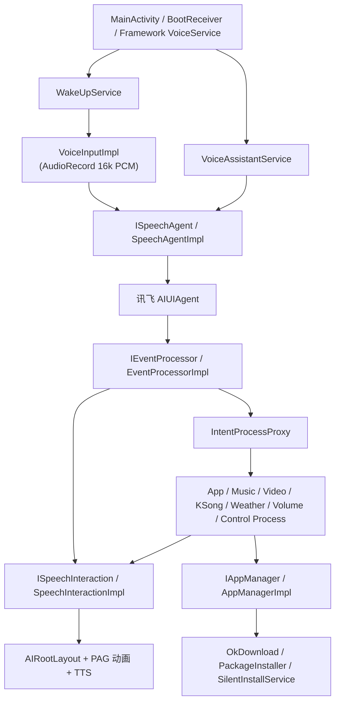
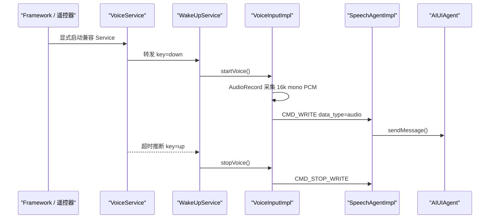
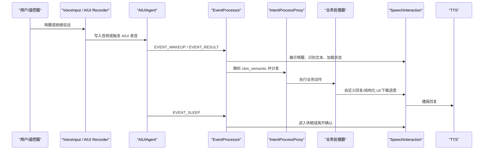

# AI Assistant Android 语音项目系统架构介绍

## 1. 项目定位

本工程是一个面向 Android 设备的语音助手应用，核心能力包括语音唤醒/按键录音、讯飞 AIUI 语音识别与语义理解、大模型/NLP 回复展示、语音合成、应用下载安装与静默升级，以及对音乐、视频、K 歌、天气、音量等场景的语义指令处理。

工程默认按系统签名应用运行。`system` buildType 会合并 `app/src/system/AndroidManifest.xml`，使应用具备 `android.uid.system`、应用常驻、开机自启动、悬浮窗交互和系统级安装等系统集成能力。工程中保留非系统签名构建，主要用于在非 root 手机上进行调试验证。

## 2. 模块划分

项目采用 Gradle 多模块结构，根工程包含 `app`、`speech`、`processor`、`downloader`、`common` 五个核心模块。

| 模块 | 职责 | 核心包路径与关键组件 |
| --- | --- | --- |
| `app` | 应用入口、系统签名运行适配、前台/常驻服务、遥控器语音按键兼容、AudioRecord 录音输入、WorkManager 升级任务、Hilt 应用级装配。 | 包路径: `cn.booslink.llm` - `MainActivity` (入口 Activity) - `BootReceiver` (开机/升级自启动接收器) - `service.VoiceAssistantService` (常驻核心前台服务) - `service.WakeUpService` & `service.VoiceService` (按键/外部语音录音控制) - `worker.UpdateCheckWorker` (后台升级检查任务) |
| `speech` | 封装讯飞 AIUI SDK，负责设备鉴权、AIUI 配置加载、AIUIAgent 生命周期、网络恢复后重连/鉴权、AIUI 事件回调入口。 | 包路径: `cn.booslink.llm.speech` - `SpeechAgentImpl` (实现 `ISpeechAgent`，负责鉴权、AIUIAgent 状态管理与事件接收分发) - `repository.ConfigRepositoryImpl` (设备鉴权与配置加载) - `repository.UpgradeRepositoryImpl` (版本升级配置查询) |
| `processor` | 负责 AIUI 事件解析、IAT/NLP/语义结果聚合、TTS 控制，以及将语义意图分发到应用、音量、天气、音乐、视频、K 歌等业务处理器。 | 包路径: `cn.booslink.llm.processor` - `EventProcessorImpl` (解析 AIUI 原始事件流，聚合 IAT/NLP 语义数据) - `tts.TTSSpeechImpl` (封装 AIUI TTS 指令，调度语音播放状态) - `process.IntentProcessProxy` (语义意图分发代理) - 业务处理器如 `app.AppProcessImpl`、`music.NetEaseMusicProcessImpl`、`video.VideoProcessImpl`、`ksong.KSongProcessImpl`、`volume.VolumeProcessImpl`、`weather.WeatherProcessImpl`、`control.ControlProcessImpl` 等 |
| `downloader` | 负责 APK 下载队列、安装状态管理、系统静默安装、安装结果广播与事件分发。 | 包路径: `cn.booslink.llm.downloader` - `AppManagerImpl` (实现 `IAppManager`，管理串行下载与安装队列，控制下载与静默安装状态机) - `AppUpgradeManager` (升级包本地状态与调度) - `service.SilentInstallService` (Android Q 及以上静默安装状态接收服务) - `receiver.PkgInstallBroadcastReceiver` (监听系统应用安装广播，反馈队列状态) - `bus.RxApkBusImpl` (下载/安装进度事件总线) |
| `common` | 公共模型、枚举、网络层、缓存、图片加载、语音交互 UI、存储、工具类和基础组件。 | 包路径: `cn.booslink.llm.common` - `ui.SpeechInteractionImpl` (实现 `ISpeechInteraction`，驱动全局悬浮窗交互和 LiveData 数据更新) - `widget.AIRootLayout` (语音交互展示与 PAG 动画控制根布局) - 网络配置（Retrofit/OkHttp 拦截器）、通用语义模型、本地 SharedPreferences 存储、图片加载组件 |

外部资源主要包括：

| 目录 | 内容 |
| --- | --- |
| `iflytek/libs` | 讯飞 AIUI 本地 Jar。 |
| `iflytek/jniLibs` | AIUI 和唤醒相关 so 库。 |
| `iflytek/assets` | AIUI 配置、VAD、IVW 唤醒资源。 |
| `app/src/main/assets` | PAG 表情动画和内置应用摘要 `app_summary.json`。 |
| `keystore` | 系统签名和调试签名 keystore。文档只描述用途，不记录口令。 |

## 3. 构建与签名体系

`app/build.gradle.kts` 定义了两个 buildType，默认交付关注 `system`：

- `system`：系统签名包，使用系统签名配置，并合并 `app/src/system/AndroidManifest.xml`。
- `release`：非系统签名调试包，主要用于在非 root 手机上安装调试。

工程还定义了三个渠道 flavor：

- `pub`：默认公开渠道，包名为 `cn.booslink.llm`。
- `bjbs`：业务渠道，包名沿用默认值。
- `voice`：语音遥控渠道，包名为 `com.booslink.aivoiceremote`。

最终 APK 文件名会按 `VoiceHelper_${CHANNEL}_${ENV}_${DATE}_V${versionName}.apk` 规则生成。当前构建配置中 `isDevMode = true`，因此包为可调试、未混淆形态，并且 `BuildConfig.DEBUG_MODE` 和 `BuildConfig.LOG_SWITCH` 会注入运行时。

系统签名 Manifest 声明：

- `android:sharedUserId="android.uid.system"`，用于系统 UID 运行。
- `android:persistent="true"`，提高系统进程保活能力。
- `RECEIVE_BOOT_COMPLETED` 和 `BootReceiver`，用于开机或应用升级后自启动。
- `INSTALL_PACKAGES`、`READ_INSTALL_SESSIONS` 等权限配合 `downloader` 模块完成静默安装。

主 Manifest 保留核心录音、网络、悬浮窗、前台服务等能力，并通过 signature 级自定义权限保护 `WakeUpService`。

## 4. 总体运行架构

运行时可以按四层理解：

1. 入口与常驻层：`MainActivity`、`BootReceiver`、`VoiceAssistantService`、`WakeUpService`、兼容 Framework 调用的 `VoiceService`。
2. 语音能力层：`SpeechAgentImpl` 封装 AIUIAgent，`VoiceInputImpl` 提供外部录音写入，`TTSSpeechImpl` 使用 AIUI TTS。
3. 语义处理层：`EventProcessorImpl` 解析 AIUI 事件，`IntentProcessProxy` 将语义意图分发给不同业务处理器。
4. 展示与执行层：`SpeechInteractionImpl` 驱动 UI 和语音播报，`downloader` 负责下载、安装和升级。

## 5. 启动与常驻流程

应用启动时，`AIApplication` 作为 Hilt 根节点完成依赖注入初始化，并提供自定义 WorkManager `HiltWorkerFactory`。同时它会根据 Android 版本安装 MultiDex/BoostMultiDex，初始化 Timber 日志，并通过 `ScreenAdapter` 统一宽度适配。

`MainActivity` 是应用入口。系统签名场景下，它主要负责拉起后台语音服务：

1. 设置横屏、全屏和常亮。
2. 判断当前是否为系统应用。
3. 系统应用直接启动 `VoiceAssistantService` 并结束 Activity。

系统签名版本使用 `BootReceiver` 监听 `BOOT_COMPLETED` 和 `MY_PACKAGE_REPLACED`，在开机或应用更新后延迟启动主入口，从而触发服务启动和语音助手初始化。

`VoiceAssistantService` 是语音助手的核心常驻服务。它在 `onCreate()` 中创建 AIUIAgent，并调度每日升级检查任务。系统签名运行时，它会将 `SpeechInteractionImpl` 附着到 WindowManager 悬浮窗，并以前台服务通知方式保持运行。

## 6. 语音输入链路

项目支持两类输入模式：

- AIUI 内部自动录音：当配置中启用自动录音时，`SpeechAgentImpl` 向 AIUI 发送 `CMD_START_RECORD`。
- 外部按键录音：遥控器或 Framework 触发 `WakeUpService`，由 `VoiceInputImpl` 使用 `AudioRecord` 采集 PCM 数据并写入 AIUI。

外部按键录音流程如下：

`VoiceService` 用于兼容 Framework 显式指定的服务名 `com.booslink.tmallvoiceremotecontrol.service.VoiceService`。它根据连续调用间隔推断按键按下和松开：首次调用转发 `down`，后续连续调用刷新超时，超时后转发 `up`。`WakeUpService` 收到 `down/up` 后调用 `IVoiceInput.startVoice()` 或 `stopVoice()`。

`VoiceInputImpl` 的录音参数为 16000Hz、单声道、PCM 16bit。开始录音后，它在 IO 线程循环读取音频缓冲区，并在 AIUI ready 时发送 `CMD_WRITE`。停止时会延迟 1 秒释放录音资源，并发送 `CMD_STOP_WRITE`，给尾音和 VAD 留出缓冲时间。

## 7. AIUI 接入与鉴权

`speech` 模块的核心类是 `SpeechAgentImpl`，它实现了 `ISpeechAgent` 和 `AIUIListener`。

初始化流程：

1. `VoiceAssistantService` 调用 `mSpeechAgent.createAgent()`。
2. `SpeechAgentImpl` 检查网络状态，避免离线时创建 Agent。
3. 通过 `IConfigRepository.deviceAuth()` 向服务端发起设备鉴权。
4. 如果本地曾经鉴权成功，则可提前初始化 AIUIAgent；首次鉴权成功后写入 `ISpeechStorage`。
5. `readConfig()` 从 `iflytek/assets/cfg/aiui_config.json` 读取配置，按当前包名修正 IVW 资源路径，复制唤醒资源到 `filesDir`，并注入 AIUI 登录配置。
6. 创建 `AIUIAgent.createAgent(context, params, listener)`。
7. AIUI 进入 READY 且设备鉴权完成后，自动发送 `CMD_WAKEUP`，并发送一条启动文本“今天天气怎么样”作为启动交互。

网络变化由 `NetworkMonitor` 驱动。未鉴权且网络恢复时会重新创建 Agent；离线时 UI 会提示“等待联网鉴权”。鉴权失败时会重置本地鉴权状态，并通过 `ISpeechInteraction.authFailed()` 展示失败原因。

## 8. AIUI 事件解析与语义分发

`AIUIAgent` 的事件统一回调到 `SpeechAgentImpl.onEvent()`。设备未鉴权前只处理状态和鉴权相关流程，鉴权后事件交给 `EventProcessorImpl.processEvent()`。

`EventProcessorImpl` 主要处理以下事件：

| AIUI 事件 | 处理方式 |
| --- | --- |
| `EVENT_STATE` | 记录 AIUI 当前状态。 |
| `EVENT_WAKEUP` | 唤醒 UI，展示“Bobo在听，有什么可以帮您~”。 |
| `EVENT_RESULT` | 将结果事件放入 RxJava Flowable，异步解析 `event.info` 和 `event.data`。 |
| `EVENT_SLEEP` | 根据下载/安装任务状态和离开确认配置决定继续唤醒、展示离开确认或隐藏 UI。 |
| `EVENT_TTS` | 转发到 `TTSSpeechImpl` 更新 TTS 状态。 |
| `EVENT_ERROR` | 展示空响应；网络错误或超时时提示“网络出现错误”。 |

AIUI 结果内部按 `CBMSub` 分类处理：

- `iat`：识别用户语音文本，更新查询区。
- `cbm_tidy`：语义规整文本，替换更规范的用户查询。
- `cbm_semantic`：传统语义技能结果，解析为 `UIResponse` 后分发业务意图。
- `nlp`：大模型/NLP 流式回复，边生成边展示，结束时触发 TTS。
- `event`：处理 VAD 起止事件；用户开始说话时取消当前 TTS。
- `tts`：语音合成状态。

语义分发与处理器设计由 `IntentProcessProxy` 主导。解析流程如下：
1. **意图路由决策**：`IntentProcessProxy.processIntent()` 接收 `UIResponse` 及解析出的语义意图列表 `List<Semantic>`。它遍历意图，通过各业务处理器的 `shouldXXXProcess()` 方法结合当前前台应用包名进行过滤。
2. **回复拦截机制**：当某个处理器成功处理了意图（返回的 `VoiceResult.getHandled()` 为 true），它将作为最终执行分支。如果该结果未设置忽略大语言模型回复（`!handleResult.getIgnoreNlpResponse()`），则会通过 `ISpeechInteraction.customAnswer()` 播报自定义 TTS，并拦截后续的默认大模型（NLP）通用回复。

在业务处理器设计上，项目针对复杂的视频和K歌场景引入了 **委托 Action 模式**：

#### 视频处理器设计 (`VideoProcessImpl`)
`VideoProcessImpl` 主要处理视频播放相关的播控指令（如倍速、清晰度、跳转时间、弹幕等）。为了兼容各种第三方视频 App，它抽象了 `IVideoAction` 接口。
- **Action 接口定义**：`IVideoAction` 声明了包括搜索、频道切换、倍速切换、弹幕控制、进度跳转等标准视频接口。
- **现有 Action 落地**：目前工程下实现了 `IQiYiVideoAction` (爱奇艺)、`YouKuVideoAction` (优酷)、`TencentVideoAction` (腾讯视频)、`ManGoTVVideoAction` (芒果TV)、`CBoxTVVideoAction` (央视影音)。
- **当前的局限性**：在 `VideoProcessImpl` 的 Hilt 构造注入中，仅注入了 `@Named("iqiyi") IVideoAction` 实例。其内部的包名路由方法 `getVideoActionByPkgName()` 暂时为 `TODO` 状态，硬编码返回了 `mIQiYiVideoAction`，当前实际仅支持爱奇艺的指令下发。

#### K歌处理器设计 (`KSongProcessImpl`)
`KSongProcessImpl` 面向全民K歌、多唱、智能K歌等主流K歌应用提供点歌、播控、切歌、原伴唱切换等能力，同样抽象了 `IKSongAction` 接口。
- **现有 Action 落地**：实现了 `BslQmKSongAction` (Booslink 内部定制版全民K歌)、`QuanMinKSongAction` (腾讯官方版全民K歌TV版)、`DuoChangKSongAction` (多唱K歌)、`SmartKSongAction` (智能K歌/包含雷卡K歌配置)。
- **包名动态匹配**：与视频硬编码不同，`KSongProcessImpl.getKSongAction()` 实现了前台包名的动态路由：
  - `com.tencent.karaoketv` (腾讯官方版全民K歌) $\rightarrow$ 动态获取 `mQuanMinActionLazy`
  - `com.evideo.kmbox` (多唱K歌) $\rightarrow$ 动态获取 `mDuoChangActionLazy`
  - `com.huiaichang.sdm.desktop` / `com.huiaichang.mars.desktop` (智能/雷卡K歌) $\rightarrow$ 动态获取 `mSmartActionLazy`
  - 默认/`cn.booslink.kg` (定制版全民K歌) $\rightarrow$ 返回 `mBslQmActionLazy`
  - *注：对雷石K歌 (`cn.jmake.karaoke.box.ott`) 包名仅作了常量定义，在 Action 匹配时暂返回 `null`。*

#### 待完善/未挂载的业务处理器
在 `processor/process` 目录下还存在部分意图处理类，它们已完成接口或框架设计，但暂未绑定或引入到主路由 `IntentProcessProxy` 中：
- `BrightProcessImpl` (`IBrightProcess`)：系统亮度调节逻辑（增/减/最亮/最暗）。
- `DanceProcessImpl` / `VltDanceAction` (`IDanceProcess`)：舞蹈动作控制。
- `IDramaProcess`：戏曲语义意图处理。

完整的处理器及典型能力清单如下：

| 处理器 | 典型能力与限制 |
| --- | --- |
| `AppProcessImpl` | 启动、下载、安装应用；结合应用摘要和服务端 APK 信息。 |
| `NetEaseMusicProcessImpl` | 打开网易云音乐、退出音乐应用、页面返回。 |
| `VideoProcessImpl` | 视频播控、倍速、清晰度、跳转、弹幕等。**当前硬编码委托给 `IQiYiVideoAction`**。 |
| `KSongProcessImpl` | 点歌、置顶、切歌、重唱、原伴唱、评分控制等。**根据前台包名动态路由 Action 委托**。 |
| `VolumeProcessImpl` | 音量增减、最大/最小、指定音量、静音/取消静音。 |
| `WeatherProcessImpl` | 将天气语义响应转换为天气 UI 和 TTS 数据。 |
| `ControlProcessImpl` | 处理系统退出（EXIT/EXIT_AGENT/SETTING_CLOSE）指令，让语音助手休眠。 |

处理器返回 `VoiceResult` 后，`EventProcessorImpl` 根据结果决定是否拦截 NLP 默认回复、是否展示自定义回答，以及是否更新查询状态为完成。

## 9. 交互 UI 与 TTS

`common` 模块提供 UI 抽象 `ISpeechInteraction`，实现类为 `SpeechInteractionImpl`。为了在系统全局任意界面展示语音交互效果，它并不直接持有 Activity，而是维护了一组被主布局 `AIRootLayout` 监听的 LiveData 状态：

- `VoiceQuery`（`mVoiceInputLiveData`）：当前语音输入的用户文本及查询状态（`QueryState`）。
- `String`（`mNplResponseLiveData`）：大模型（NLP）或自定义流式回复文本。
- `UIResponse`（`mUIResponseLiveData`）：结构化的语义实体数据（如天气列表、睡眠/退出确认等）。
- `ApkDownload`（`mApkDownloadLiveData`）：应用升级与下载进度信息。
- `EmoteState`（`mEmoteStateLiveData`）：AI 助手的表情状态，用以配合动画表现。

#### 悬浮窗 Window 属性配置
在系统签名运行下，交互 UI 并不是一个普通的 Activity，而是通过 `WindowManager` 动态 attach 到系统窗口层的悬浮窗布局。在 `SpeechInteractionImpl.attachToWindow()` 中：
- **层级适配**：根据系统 API 版本，在 Android 8.0（API 26）及以上使用 `WindowManager.LayoutParams.TYPE_APPLICATION_OVERLAY`；在 Android 7.1 及以下使用 `WindowManager.LayoutParams.TYPE_SYSTEM_ALERT`，确保覆盖在所有应用最上层。
- **Flag 掩码配置**：
  - `FLAG_NOT_TOUCH_MODAL | FLAG_NOT_FOCUSABLE`：不拦截下方窗口的焦点和触摸事件，使用户在语音助手展示时依然能操作下方应用。
  - `FLAG_WATCH_OUTSIDE_TOUCH`：监听悬浮窗外的触摸，以便点击空白处时能自动收回/休眠语音助手。
  - `FLAG_HARDWARE_ACCELERATED`：强制启用硬件加速，防止在 Android 4.4 等低配置系统上，当其他大内存 App 启动时导致悬浮窗重叠区渲染滞后或闪烁。
- **几何限制**：悬浮窗统一挂载在屏幕右上角（`Gravity.TOP | Gravity.END`），宽度硬编码限制为 `554dp`（使用 `ContextUtils.dp2px()` 转换），高度为自适应 `WRAP_CONTENT`，避免大面积遮挡。

#### 助手表情状态机 (`QueryState` -> `EmoteState` -> PAG)
语音助手表情由 `AIRootLayout` 内置的 PAG 动效组件渲染，PAG 资源文件放置在 `app/src/main/assets` 中。`SpeechInteractionImpl` 根据 `QueryState` 的跃迁来驱动 `EmoteState` 状态，从而切换不同的 PAG 表情：

| 查询状态 (`QueryState`) | 表情状态 (`EmoteState`) | PAG 表情动作与语义 |
| --- | --- | --- |
| `IDLE` | `IDLE` | 闲置状态，Bobo 处于微动呼吸待命状态。 |
| `QUERYING` | `THINKING` | 正在理解或大模型生成中，Bobo 表现为思考/转圈动画。 |
| `DONE` | `LAUGHING` | 成功执行指令或回复，Bobo 表现为开心/微笑动画。 |
| `FAILED` / `EMPTY` / `ERROR` | `CRYING` | 鉴权失败、无响应、超时或网络故障，Bobo 表现为哭泣/委屈动画。 |
| `WAKE_UP` / `DOWNLOADING` | `NORMAL` | 刚被唤醒或正在后台下载/安装 APK，Bobo 处于正常交互状态。 |

*注：在不支持或加载 PAG 库失败的低版本 Android 系统中，动效会自动降级为静态表情图片逻辑，以保证系统兼容性。*

#### TTS 播控与中断
TTS 播报统一由 `TTSSpeechImpl` 负责，其通过向 AIUI 发送 `AIUIConstant.CMD_TTS` 指令，使用内置合成引擎将文本转化为语音（默认发音人为 `x4_lingxiaoying_em_v2`）。
为了避免 TTS 播报与用户输入发生冲突：
1. **用户说话中断**：当 VAD（Voice Activity Detection）检测到用户再次开始说话（回调 `EVENT_RESULT` 包含 `event=event_vad_start`）时，`EventProcessorImpl` 会立即调用 `TTSSpeechImpl` 停止当前播放，保证“随说随停”。
2. **状态与表情同步**：TTS 播放事件（开始/结束/错误）会通过 `EVENT_TTS` 实时回调，用来同步更新交互界面的波形指示器和表情状态。

## 10. 应用下载、安装与升级

应用安装能力集中在 `downloader` 模块，它主要支持应用的按需点播下载安装以及本语音助手的后台静默升级。

#### 下载与安装队列管理 (`AppManagerImpl`)
由 `AppManagerImpl` 作为核心控制器，通过结合三方库 `OkDownload` 和 RxJava，实现了串行、防抖、可重试的下载与静默安装状态机：
1. **单任务下载限制**：为了保证设备带宽及资源消耗，同一时间只能有一个活跃的下载任务（`mDownloadingTask`）。
2. **串行任务队列**：通过 `LinkedHashMap<String, ApkDownload>` 维护全局的下载与安装队列。
   - 当收到下载请求时，若当前有任务正在运行，则新任务以 `ApkStatus.DOWNLOAD_PADDING` 状态加入队列尾部。
   - 任务下载完成后，回调会触发安装流程，任务状态变为 `ApkStatus.INSTALL_GOING`。
   - 安装完成后，`AppManagerImpl` 从本地删除成功安装的临时 APK 文件（保证存储空间占用最小），并将已完成任务从 `LinkedHashMap` 中移除。
   - 随后，自动调用 `startNextPaddingItem()`，轮询并触发队列中的下一个等待任务。
3. **进度发布总线**：任务在队列中的每一次状态跳变（从 `PADDING` 到 `PROGRESS`，再到 `INSTALL_GOING` 和 `INSTALL_SUCCESS`/`FAIL`）都会通过 `IRxApkBus` 事件总线实时发送，从而驱动交互 UI 的下载进度展示。

#### 系统签名下的双轨静默安装机制
在设备为系统签名应用运行（`DeviceInfo.isSystemApp() == true`）的场景下，应用可以绕过系统默认的弹窗授权提示，实现完全的静默安装。由于 Android 各大版本对系统安装 API 的变动极大，项目在 `AppManagerImpl.install()` 和 `ApkInstallUtils` 中设计了双轨静默安装方案：
- **Android Q（API 29）及以上系统**：使用官方推荐的 `PackageInstaller` API（封装在 `ApkInstallUtils.installerInstall()` 中）。通过向 `PackageInstaller` 写入 APK 字节流创建 Session，并指定 `SilentInstallService`（一个后台 Service）接收安装结果的 `Intent` 广播回调。
- **Android Q 以下系统**：通过引入预编译的系统底层组件 `classes_secure.jar`，直接反射调用底层隐藏的 `PackageManager.installPackage()` 私有系统接口。传入自定义的 `PackageInstallObserver`（继承自 `IPackageInstallObserver.Stub`）接收跨进程 Binder 回调，实现低版本的高效静默安装。
- **非系统 App 回退**：若当前运行在非系统应用模式下（例如在非 root 手机上进行联调测试），系统会检查 `Settings.ACTION_MANAGE_UNKNOWN_APP_SOURCES` 权限，并退回到常规的 Android 官方应用安装器 Activity 唤起流程（`ApkInstallUtils.install()`）。

#### 静默升级检测 (`UpdateCheckWorker`)
助手的后台自动升级机制由 Android `WorkManager` 提供保障。
1. **任务注册与周期**：在 `VoiceAssistantService.onCreate()` 启动时，它会调度一次立即执行的单次升级检查任务，并向系统注册一个 24 小时周期的定时升级任务（`PeriodicWorkRequest`）。
2. **网络与调度约束**：`UpdateCheckWorker` 包含网络连接约束（必须在有网络连接时才执行）以及进程内的防抖逻辑（5 分钟防抖和并发锁，防止频繁或并行的重复请求导致服务端压力过大）。
3. **升级闭环**：Worker 从远端获取版本配置，一旦发现服务端的 `versionCode` 高于当前本地应用版本，则立即唤起 `AppUpgradeManager.startDownload()` 启动下载，下载完毕后自动执行系统静默安装，完成助手的无感升级与自动重启。

## 11. 网络、缓存与存储

公共网络层由 `CommonModule` 提供：

- `OkHttpClient`：统一超时、连接池、日志拦截器，并在 app 模块强制 OkHttp 版本为 `3.12.12` 以兼容低 API。
- `Retrofit`：基准地址为 `Constants.BASE_URL`，实际接口大量使用绝对 URL 或动态 `@Url`。
- `Gson`：注册 AIUI 语义相关枚举和结构的自定义适配器。
- `NetworkMonitor`：监听网络变化，驱动鉴权、重连和错误提示。

本地存储由 `SpeechStorageImpl` 基于 SharedPreferences 实现，保存离开确认开关、最近升级检查时间、鉴权成功标记和鉴权服务 host。应用摘要使用 `IAppCache` 做一日缓存，降低频繁请求配置服务的成本。

## 12. 依赖注入与扩展方式

项目全面采用 Hilt 进行依赖注入（DI）管理，核心的依赖提供（`@Provides`）与接口绑定（`@Binds`）按模块高内聚组织：

- **`AppModule`**：挂载于 `SingletonComponent`。提供全局底层设备信息 `DeviceInfo`、包升级调度 `AppUpgradeManager` 以及外部录音接口 `IVoiceInput`。
- **`SpeechBinds`**：绑定 `ISpeechAgent`（指向 `SpeechAgentImpl`）、`IConfigRepository`（设备鉴权）及 `IUpgradeRepository`（版本控制）。
- **`ProcessorModule`**：定义在 `processor` 模块下，管理事件解析器与业务分发的绑定。
  - 核心接口绑定：`IEventProcessor` -> `EventProcessorImpl`，`ITTSSpeech` -> `TTSSpeechImpl`，`IIntentProcess` -> `IntentProcessProxy`。
  - **限定符与 Action 绑定**：由于 `IVideoAction` 和 `IKSongAction` 存在多套针对不同 App 的实现类，项目在此处使用了 Hilt 的 `@Named` 限定符完成特定绑定：
    - 如 `@Binds @Named("quanmin") IKSongAction` 指向 `QuanMinKSongAction`；
    - `@Binds @Named("duochang") IKSongAction` 指向 `DuoChangKSongAction`；
    - `@Binds @Named("iqiyi") IVideoAction` 指向 `IQiYiVideoAction`。
- **`DownloaderModule`**：绑定 `IAppManager` -> `AppManagerImpl`，以及下载与安装总线 `IRxApkBus` -> `RxApkBusImpl`。
- **`CommonModule` / `CommonBinds`**：提供网络组件（OkHttpClient/Retrofit）、JSON 序列化（Gson）、单例 Toast（`IToast`）、偏好存储 `ISpeechStorage` 以及全局交互抽象 `ISpeechInteraction` -> `SpeechInteractionImpl`。

#### 如何新增或扩展一个语义能力
若项目需要接入一个新的语义场景（例如新增“戏曲”或“亮度”控制指令支持），推荐按照以下架构标准步骤进行扩展：
1. **定义协议模型**：
   - 在 `common` 模块的 `Category` 和 `AIUIIntent` 中增加对应的枚举成员。
   - 在相关的语义模型或自定义 Gson 适配器中注册相关字段。
2. **编写业务处理器与委托 Action**：
   - 在 `processor/process` 目录下创建子包（如 `drama`），定义业务接口及 `ProcessImpl` 实现类。
   - 如果对应多个三方 App，设计委托 `Action` 接口，并针对具体 App 编写实现类。
3. **注册 DI 绑定**：
   - 在 `ProcessorModule.java` 中，使用 `@Binds` 将新写的 `ProcessImpl` 绑定到对应接口。
   - 若有多个委托 Action 落地，使用 `@Named("标识")` 进行修饰绑定。
4. **注入代理与挂载路由**：
   - 修改 `IntentProcessProxy`，在构造器中注入新写的业务 Process 接口（如果需要动态获取 Action，可注入 `Lazy<IXXXAction>`）。
   - 在 `processIntent(UIResponse response, Semantic semantic)` 方法中，通过类似 `shouldXXXProcess()` -> `handleXXXIntent()` 的链条将意图分发挂载进去。
5. **UI 扩展展示（可选）**：
   - 若新业务需要展示特定的结构化布局，可在 `ISpeechInteraction` 中提供对应的通知状态接口，并在 `SpeechInteractionImpl` 内定义相应的 LiveData。
   - 在 `AIRootLayout` 或新建对应 `Layout` 中监听此 LiveData，完成 UI 层的响应式刷新。

## 13. 关键运行链路总结

一次完整语音交互可以概括为：

系统签名能力使该链路可以在无前台 Activity 的情况下常驻运行，并完成系统级安装、开机自启和全局悬浮窗交互。
